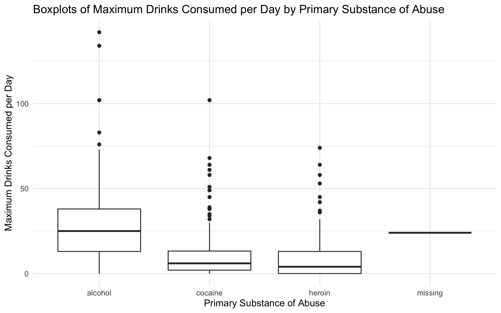

# Assignment 4

**Note:** This assignment was done using RStudio with R language. You can find the code for this assignment [here](https://github.com/abin733/Assignment-4).

## Section A

### Task 1 - Cohort Characteristics

Table 1 Cohort Characteristics:

|            | Total | Female (23.62%) | Male (76.38%) |
|------------|-------|------------------|----------------|
| Age, years | Mean: 35.75 (SD: 7.79) | Mean: 36.07 (SD: 7.71) | Mean: 35.65 (SD: 7.84) |
|            | Median: 35 (IQR: 30-41) | Median: 35 (IQR: 31-40.5) | Median: 35 (IQR: 30-41) |
| Race group | Black: 218 (46.38%) | Hispanic: 51 (10.85%) | Other: 28 (5.96%) | White: 173 (36.81%) |
| Homeless   | Homeless: 219 (46.60%) | Homeless: 42 (37.84%) | Homeless: 177 (49.30%) |
| ... (other characteristics) |

### Task 2

#### a) Homelessness by Sex

- Approximately 46.59% of the total sample reported being homeless.
- Among females, about 37.84% reported being homeless.
- Among males, approximately 49.30% reported being homeless.

#### b) Primary Substance of Abuse by Sex

- The total percentage of individuals who reported alcohol as their primary substance of abuse is approximately 39.36%.
- Among females, about 33.33% reported alcohol as their primary substance of abuse.
- Among males, around 41.23% reported alcohol as their primary substance of abuse.

## Section B

### Task 3 - Cohort Characteristics: Substance Abuse Post-Detox

Table 2 Cohort Characteristics: Substance Abuse Post-Detox:

|            | Total | Female (36.04%) | Male (43.45%) |
|------------|-------|------------------|----------------|
| Age, years | Mean: 35.75 (SD: 7.79) | Mean: 36.07 (SD: 7.71) | Mean: 35.65 (SD: 7.84) |
|            | Median: 35 (IQR: 30-41) | Median: 35 (IQR: 31-40.5) | Median: 35 (IQR: 30-41) |
| ... (other characteristics) |

### Task 4

#### A. Plot the distributions of age by sex.

- The two-sample t-test indicated that there was no statistically significant difference in mean age between females and males in the sample.

#### B. Plot a histogram of 'lifetime number of hospitalizations for medical problems' and describe the distribution.

- The distribution of "Lifetime Number of Hospitalizations for Medical Problems" is positively skewed with a right tail.
- The mean number of hospitalizations is 3.1, with a high standard deviation indicating variability.

#### C. Plot a figure containing boxplots showing the maximum number of drinks consumed per day stratified by primary substance of abuse.

- The boxplot summary reveals insights into alcohol consumption and potential outliers.

## Section C

### Task 8

- Median for Group A (<= medianAllBili): 0.8
- Median for Group B (> medianAllBili): 3.5

### Task 9

#### Table for Treatment Category

|            | D-penicillamine | Placebo |
|------------|-----------------|---------|
| Count      | 158             | 154     |

#### Table for Outcome Category

|            | Censored | Transplant | Dead |
|------------|----------|------------|------|
| Count      | 232      | 25         | 161  |

#### A. How many people died, and what percentage of those who died were in the placebo group?

- Total who died is 161.
- Percentage of those who died in the placebo group: 37.27%

#### B. What percentage of the treatment group received a transplant?

- Percentage of the treatment group (D-penicillamine) that received a transplant: 6.33%

### Task 10

#### A. What is the risk ratio of having a transplant or dying in the treatment compared to the placebo group?

- Risk Ratio of having a transplant or dying in the treatment group compared to the placebo group: 0.92

#### B. How would you report this in words?

- The risk of having a transplant or dying in the treatment group (D-penicillamine) was 0.92 times lower compared to the placebo group.

#### C. What is the odds ratio of having a transplant or dying in the treatment compared to the placebo group?

- Odds Ratio of having a transplant or dying in the treatment group compared to the placebo group: 0.898

#### D. How would you report this in words?

- Individuals in the treatment group had approximately 0.898 times the odds of experiencing a transplant or death compared to those in the placebo group.

### Task 11

#### A. Which stage has the most people in it?

- The stage with the most people is Stage 3.

#### B. What is the mean (SD) of age for each of the 4 stages?

| Stage | Mean Age | SD Age |
|-------|----------|--------|
| 1     | 46.84    | 9.55   |
| 2     | 49.47    | 9.62   |
| 3     | 48.96    | 10.12  |
| 4     | 53.77    | 10.82  |

#### C. Interpret the result of the ANOVA F-test that is shown in the output.

- The ANOVA F-test results show a statistically significant difference in mean age across different stages of the disease. The F-statistic is 7.227 with a p-value of 9.8e-05, indicating that there is strong evidence to reject the null hypothesis that the mean ages of individuals in all disease stages are equal.

#### D. Report the findings of the difference in mean age of people in stage 3 with those in stage 4.

- People in Stage 4 have a significantly higher mean age than those in Stage 3, with a mean age difference of approximately 4.803 years (95% CI: 1.746 to 7.860, p-value: 0.0003516).

## References

1. Bretz, F., Hothorn, T., & Westfall, P. (2016). Multiple comparisons using R. https://doi.org/10.1201/9781420010909
